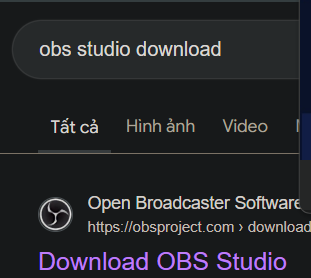
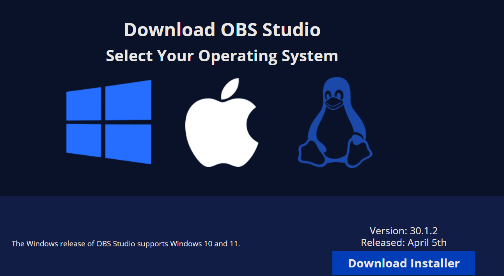
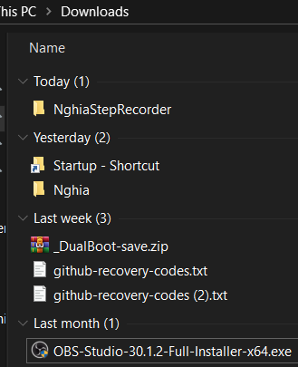
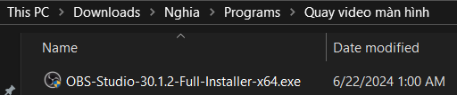
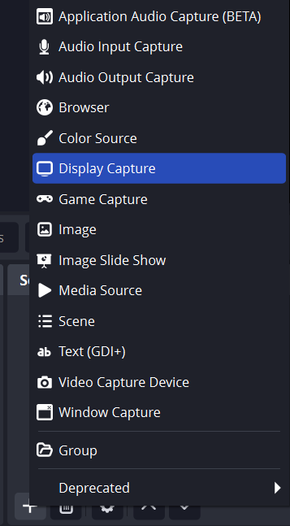
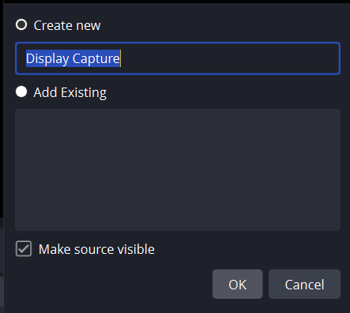
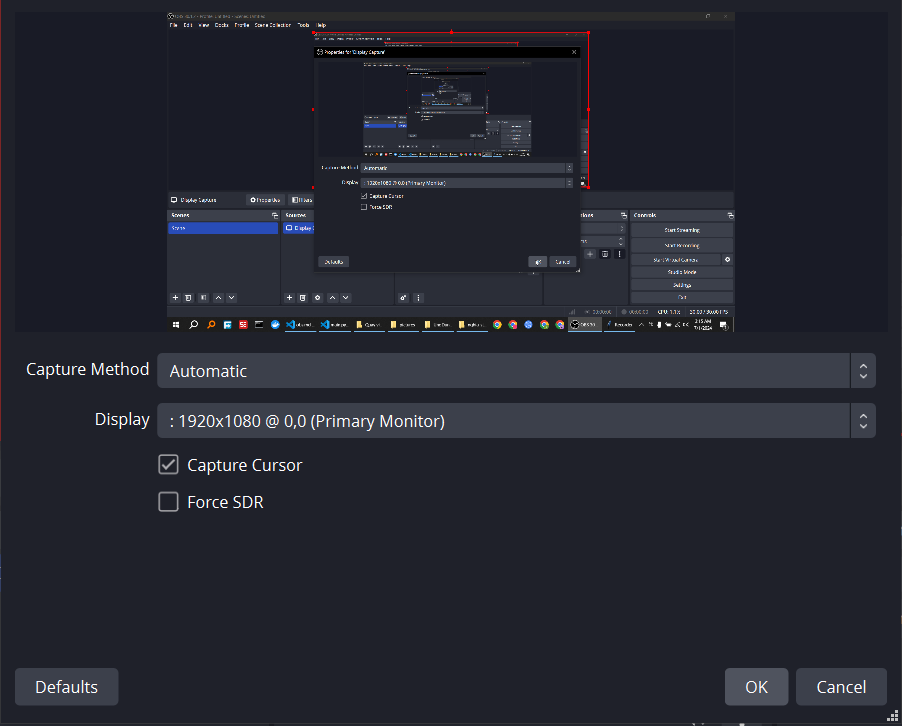
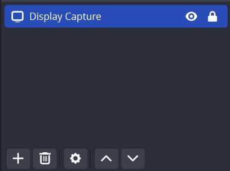

Tìm kiếm trên google: obs studio download

Chọn hệ điều hành và nút tải xuống

Sau khi tải xuống được file OBS-Studio-30.1.2-Full-Installer-x64.exe

Tạo thư mục: Quay video màn hình

Cài đặt file exe như mọi ứng dụng

Sau khi cài đặt sẽ có icon ở Desktop

Ấn dấu cộng và thêm Display Capture

Ấn OK

Ấn OK

Ấn pin ổ khóa

