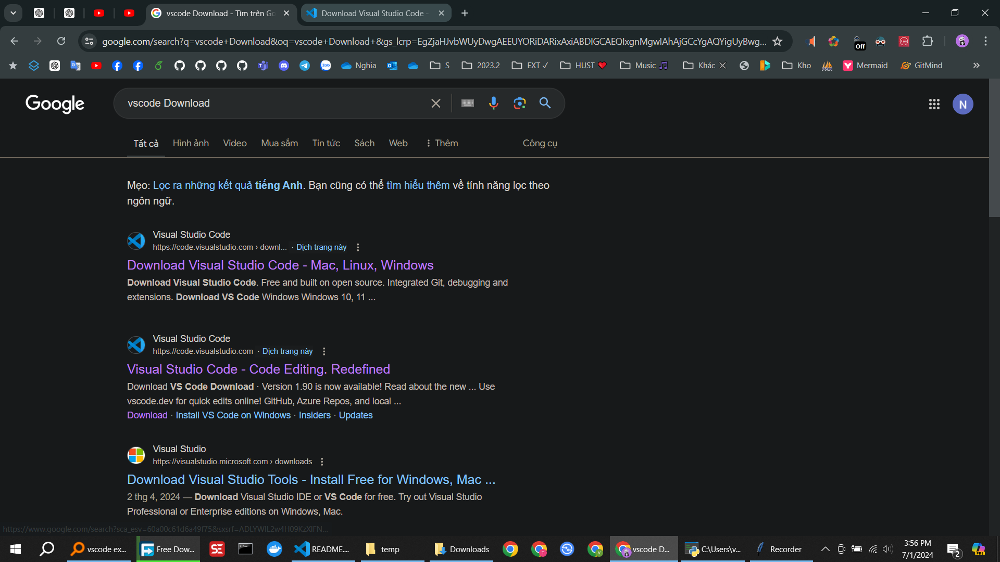
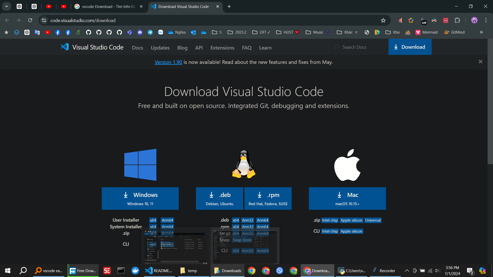
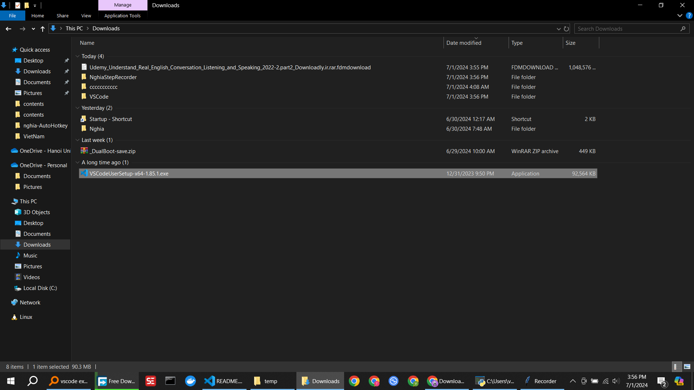
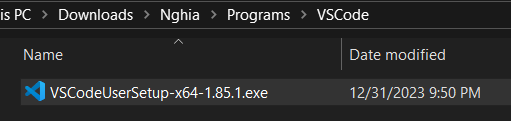

vscode Download

 

 

 

In the installer, click to activate the following two options:

Add "Open with Code" action to Windows Explorer file context menu

Add 'Open with Code" action to Windows Explorer directory context menu

